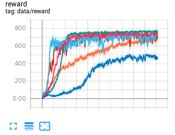

# Reconstruction of OpenAI spinningup for reinforcement-learning

* The purpose of this repository is study and research about reinforcement learning for robotics control.

* This repository provides the Model-Free reinforcement learning algorithms.

```
DDPG
PPO
PPO2
SAC
TD3
```

* These algorithms are demonstrated in Environment Reacher with [ML-Agent](https://github.com/Unity-Technologies/ml-agents).

* The mlagents denpendency is provided in this repository.

* The directory architecture have to be under format.

```
└─spinning_up_kr
   ├─env(environment of reacher in unity)
   ├─mlagents
   ├─buffer.py
   ├─core.py
   ├─ddpg.py
   ├─ou_noise.py
   ├─ppo.py
   ├─ppo2.py
   ├─sac.py
   └─td3.py
```

## Demonstration

<div align="center">
  
  
  
</div>

Reference

[1] [Proximal Policy Optimization](https://arxiv.org/abs/1707.06347)

[2] [High-Dimensional Continuous Control Using Generalized Advantage Estimation](https://arxiv.org/abs/1506.02438)

[3] [Continuous Control With Deep Reinforcement Learning](https://arxiv.org/pdf/1509.02971.pdf)

[4] [OpenAI Spinningup](https://github.com/openai/spinningup)

[5] [Reinforcement Learning Korea PG Travel](https://github.com/reinforcement-learning-kr/pg_travel)

[6] [Medipixel Reinforcement Learning Repository](https://github.com/medipixel/rl_algorithms)

[7] [Soft Actor-Critic: Off-Policy Maximum Entropy Deep Reinforcement Learning with a Stochastic Actor](https://arxiv.org/abs/1801.01290)